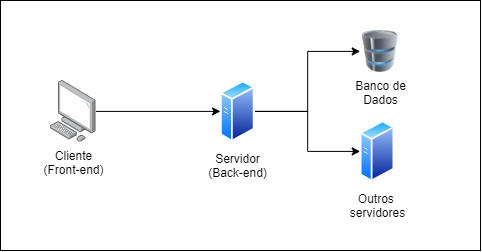

# Fundamentos da web

A Internet é um sistema global de redes de computadores interligadas com o propósito de servir usuários no mundo inteiro. É uma rede de várias outras redes, que consiste em milhões de empresas privadas, públicas, acadêmicas e de governo, com alcance local e global e que está ligada por uma ampla variedade de tecnologias de rede eletrônica, sem fio e ópticas. A internet traz uma extensa gama de recursos de informação e serviços, tais como os documentos hipertexto, web apps, e-mails, entre outros.
Por ser um sistema complexo, precisamos estudar a web por partes. Entretanto, a princípio, não é preciso entender ou se preocupar com todas as suas complexidades para ser capaz de desenvolver aplicativos web, pois a maior parte desta fica abstraído por de trás dos navegadores que utilizamos para interagir com a Web.
Os principais conceitos a serem entendidos para se iniciar na programação web são:

1.	Sistema cliente/servidor (frontend e backend)
2.	Sistema de requisições, HTTP
3.	Hipertexto e hiperlink
4.	Persistência de dados (banco de dados)

A seguir, apresentamos alguns conteúdos de inicialização a esses temas.

## Sistema de Cliente e Servidor
- Também conhecido como Front-end, o Cliente pode ser definido como o sistema que irá rodar na máquina do usuário final. Podendo ser um laptop, tablet, smartphone, ou qualquer outro dispositivo que possa se conectar à internet.
- Também conhecido como Back-end ou API, o Servidor é um sistema ou conjunto de sistemas que irá rodar em uma máquina remota, provendo serviços personalizados para o cliente (Front-end). Algumas de suas possíveis funcionalidades seriam: Acesso a dados, comunicação com outros servidores, envio de mensagens ou emails, entre outros.

## O Sistema de Requisições - HTTP
Para realizar a comunicação entre o Cliente e o Servidor é preciso que ambos falem a mesma linguagem. Para isso, surge o Sistema de Requisições. Ele estabelece uma séria de regras e protocolos para que a comunicação entre os clientes e servidores sejam padronizadas e possam funcionar corretamente. O protocolo mais importante para o desenvolvedor WEB é o `HTTP` (HyperText Transfer Protocol). Em resumo, boa parte dos sistemas web funcionam da seguinte forma:

## Hipertexto e Hiperlink - HTML

## Persistência de Dados - Banco de Dados

## Site

Site ou sistemas, nada mais são do que pastas que contém arquivos com códigos, imagens, vídeos e mais o que o seu sistema precisar.

## Servidor
## Domínio
## ORM

## Versionamento de código

Quando trabalhamos em equipe ou mesmo sozinho é sempre bom ter nosso código organizado. "Ih! deletei sem querer um código!", "O que eu estavafazendo mesmo no código na última vez que sentei nessa cadeira?". Para sanar esses problemas existe o versionador de código, onde comentamos (commit) tudo que fazemos e gravamos a evolução, o mais conhecido deles é o Git, não é o Github! Github é uma "rede social" que usa [git](https://git-scm.com/) você também vai encontrar outros como Gitlab, BitBucket... Aprender esse tema é essencial para iniciar qualquer trabalho, por isso [Bons estudos!](https://www.udemy.com/course/git-e-github-para-iniciantes/)

Se você quer mesmo fazer bem feito, aconselho observar as [boas práticas e padronizações de escrever commits](https://github.com/iuricode/padroes-de-commits)
